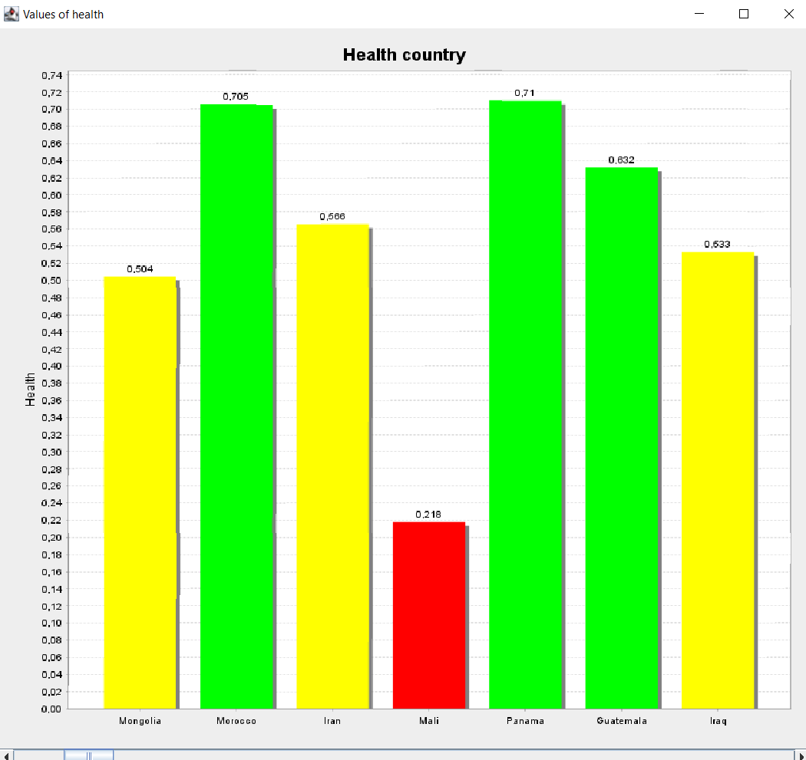
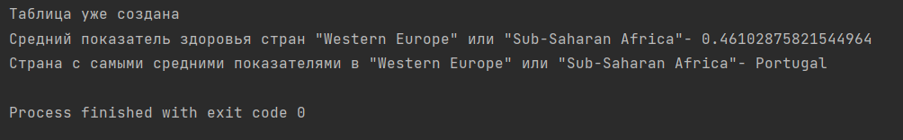

# Итоговый проект JAVA

### Вариант 7 - Показатели счастья стран 2017 года

#### Процесс работы 
* Написание POJO класса

В исходном csv довольно простая структура. В связи с этим было принято решение создать один класс для хранения данных 
из файла. Но из-за довольно большого количества полей(13) мною было принято решение 
передавать значения в конструктор через Map, ведь это снизит количество строк кода, а
также поможет избежать неправильной инициализации класса, т.к. ключи словаря- названия полей в 
таблице базы данных. POJO находится в файле `IndexOfHappiness.java`.

* Парсинг данных из CSV файла

Класс парсера находится в файле `CSVParser.java`. Класс состоит из одного статического метода
`parseCSV`, принимающего на вход путь к файлу. Сам файл находится
в директории ресурсов. 

* Взаимодействие с базой данных

Класс, отвечающий за работу с базой данных, находится в файле `DataBase.java`. За заполнение таблицы 
и подключение к базе данных отвечает метод `fillDataBase`. В случае, если подключение 
к бд по какой-то причине невозможно, в консоль будет выведено предупреждение. При повторном запуске программы в 
случае удачного первого раза будет выведено предупреждение, что таблица уже заполнена.

#### Выпонение зданий
* Задание 1: Сформируйте график по показателю здоровья, объеденив их по странам. Особенность 
моего графика заключается в покраске колонок- значения стран сравниваются по среднему показателю.
Красный- низкий показатель. Желтый- средний показатель. Зеленый- выше среднего.

Так как в таблице более 150 стран, была необходимость добавить прокрутку диаграмм, чтобы они были более читаемыми.

* Задание 2: Выведите в консоль средний показатель здоровья среди Western Europe и Sub-Saharan Africa
* Задание 3: Найдите страну с "самыми средними показателями" среди Western Europe и Sub-Saharan Africa

Это картинка отображает результат последних двух заданий.
